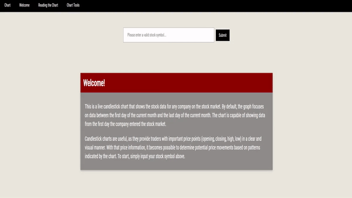
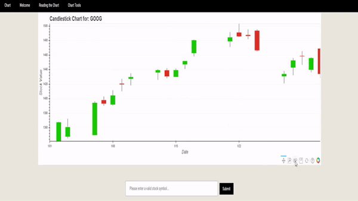

# Candlestick-Graphs
This repo is used to host my live candlestick stocks graph. Using Python, Pandas, and Bokeh, I process data from Yahoo Finance and present it on a candlestick chart. The graphs created show daily stock data from the day the company debuted on the stock market to the present.

You can check the site out [here](https://candlestick-stocks.herokuapp.com/)!

## Demo
Getting the candlestick chart for a company's stock:

Interacting with the graph:

Lets the user know when an unknown stock symbol is entered:

## Built With
* [Pandas](https://pandas.pydata.org/) - Python data analysis library
* [Bokeh](https://docs.bokeh.org/en/latest/index.html) - Data visualization library
* [Flask](http://flask.palletsprojects.com/en/1.1.x/) - Micro web framework for Python
* [Heroku](https://dashboard.heroku.com/auth/heroku/callback?code=b335d296-669a-4f76-a9fa-5132c97d42c7) - Cloud platform that the site was deployed on

## Acknowledgments
I developed this project to explore the relationship between technology and finance.

Originally, this web app only plotted Scotiabank Toronto's data because during my stock market research I found that it is an excellent long-term core holding. However, I realized that it's more beneficial to be able to view the stock data of ANY company instead of just one.
